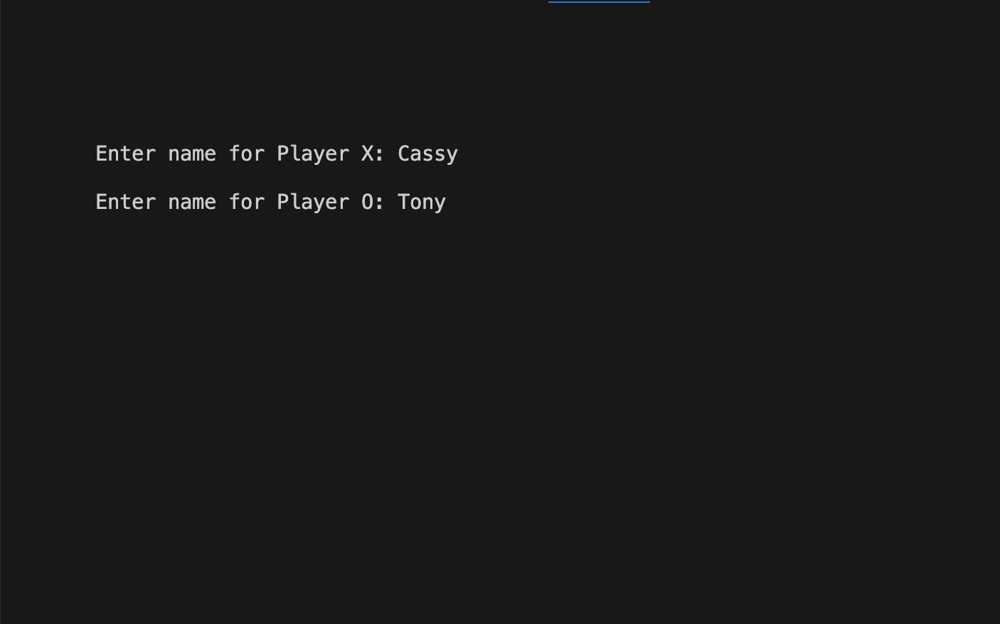
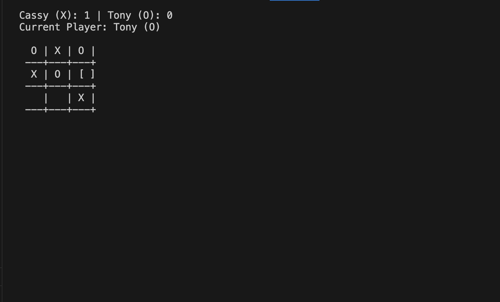
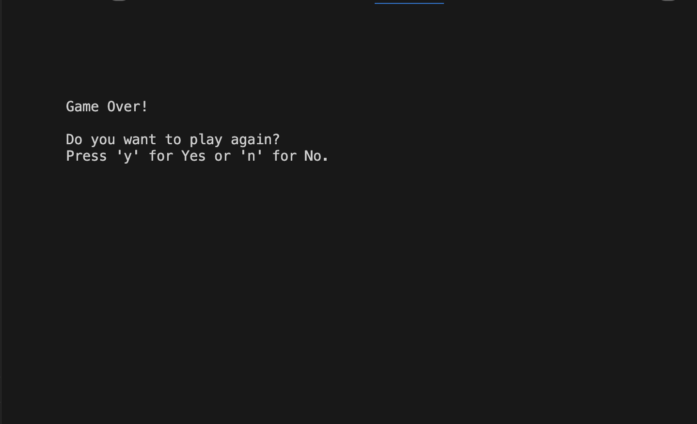
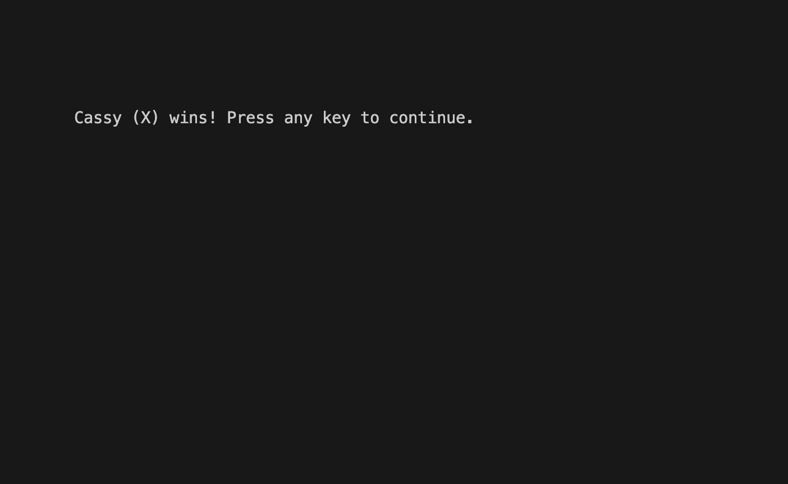

# Tic-Tac-Toe

A terminal-based implementation of the classic Tic-Tac-Toe game written in C using the NCurses library. This project demonstrates a clean approach to game logic and user interaction in a terminal environment.

---

## Screenshots

### Game Start


### Gameplay


### Game Over


### Winner Announcement


---

## Features

- **Interactive Gameplay**: Play against another player with a clear and responsive terminal interface.
- **Customizable Names**: Enter player names for a personalized experience.
- **Score Tracking**: The game keeps track of wins for each player across multiple rounds.
- **Alternating Turns**: The first player alternates between rounds to ensure fairness.
- **Endgame Menu**: Option to replay or exit the game after each round.

---

## How to Run

1. Clone the repository:
   ```bash
   git clone https://github.com/s1upee/tic-tac-toe.git
   cd tic-tac-toe
2. Compile the code: 
   ```bash
   gcc -o tic_tac_toe tic_tac_toe.c -lncurses
3. Run the game
   ```bash
   ./tic_tac_toe